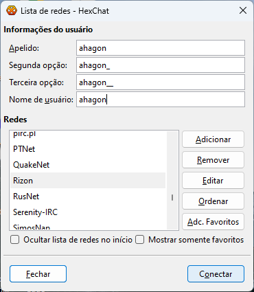
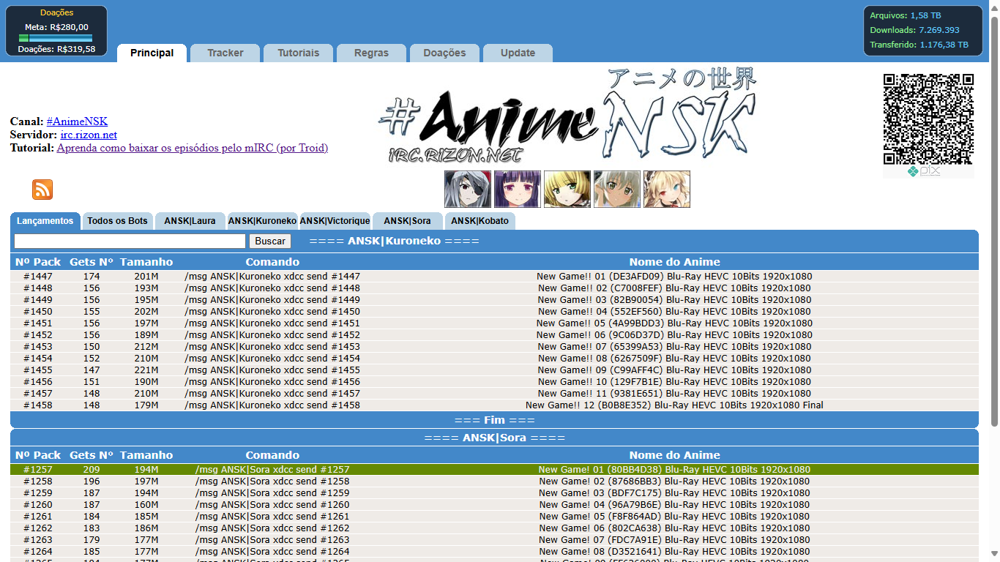
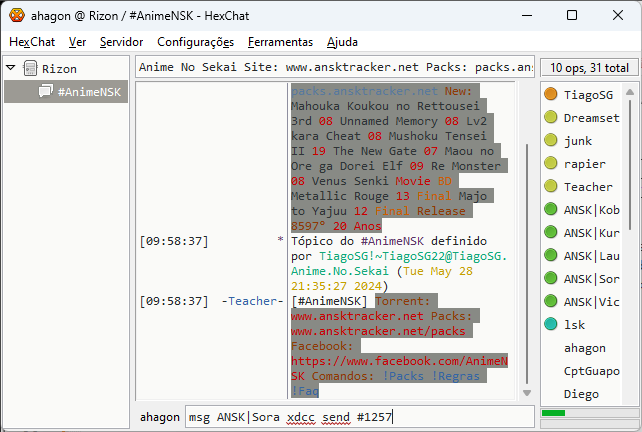
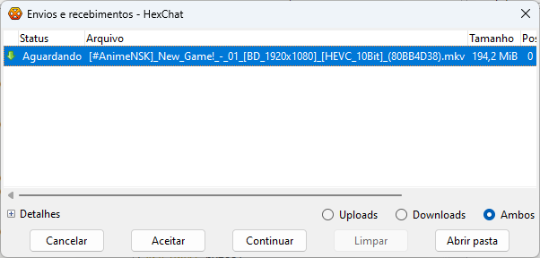

# Baixando arquivos de bots IRC/XDCC

Dentro da chamada **"pirâmide da pirataria"**, no mesmo nível dos trackers de torrent públicos, existem canais de IRC com bots que compartilham arquivos via XDCC, os chamados Fservers, bastante populares principalmente entre os fãs de animes. Neste tutorial, irei explicar o básico de como baixar animes legendados através destes Fservers, e darei algumas referências ao final para quem quiser se aprofundar mais sobre como usar o IRC.

## O que é o IRC?

O **Internet Relay Chat (IRC)** é um protocolo de chat pela internet criado em 1988, mas que ainda hoje é uma das principais formas de comunicação na comunidade de compartilhamento de arquivos. Isto porque, além de permitir a criação de um servidor de chat completamente privado por qualquer um, o IRC também permite o envio de arquivos através de uma extensão do protocolo chamada **XDCC** (_eXtended Direct Client-to-Client_).

## Como isso funciona?

Primeiramente, é necessário instalar um cliente IRC. Existem vários clientes disponíveis para diversos sistemas operacionais, entre os quais o [**HexChat**](https://hexchat.github.io/), o [**Konversation**](https://konversation.kde.org/), o [**mIRC**](https://www.mirc.com/) e o [**irssi**](https://irssi.org/).

Após instalado e configurado, utiliza-se no cliente o comando `/SERVER <host>` para se conectar a um servidor, por exemplo: `/SERVER irc.rizon.net`. Os servidores da [**Rizon**](https://rizon.net/) e [**P2P-net**](https://p2p-network.net/) são especialmente populares pela comunidade de compartilhamento de arquivos.

Uma vez conectado a um servidor, utiliza-se o comando `/JOIN #nome-do-canal` para entrar em um canal (semelhante a um grupo de WhatsApp/Telegram). No canal poderão haver, além de outros usuários, bots que compartilham arquivos em resposta a comandos especiais. Estes bots normalmente utilizam o software [**iroffer-dinoex**](https://github.com/dinoex/iroffer-dinoex) ou similares.

Mas como saber qual comando usar para receber um episódio específico de um anime, por exemplo? É aí que entra a chamada **Packlist**, um site na internet contendo a lista dos episódios e o comando que fará o bot enviar um episódio específico. Muitas packlists são feitas utilizando o software [**XDCCParser**](https://github.com/nitmir/XDCCParser-global).

### Packlists

Exemplos de packlists são:

- Animes/Português:
  - **AnimeNSK**: [https://packs.ansktracker.net/](https://packs.ansktracker.net/)
  - **Eternal Animes**: [https://packs.eternalanimes.org/](https://packs.eternalanimes.org/)
  - **Lolicons Anônimos/Avalon Fansub**: [https://packs.cgnat.net/](https://packs.cgnat.net/)
- Animes/Inglês:
  - **SubsPlease**: [https://subsplease.org/xdcc/](https://subsplease.org/xdcc/)
  - **nibl** [https://nibl.co.uk/](https://nibl.co.uk/)
  - **AniMK**: [https://xdcc.animk.info/](https://xdcc.animk.info/)
- General/Inglês:
  - **SunXDCC**: [https://sunxdcc.com/](https://sunxdcc.com/)
  - **XDCC.eu**: [https://www.xdcc.eu/](https://www.xdcc.eu/)

Muitas vezes, na própria packlist, já é fornecida a informação do servidor e do canal que o usuário precisa se conectar para poder se comunicar com o bot. Em posse da packlist, o usuário consulta e envia o comando para baixar um lançamento específico, e o bot do canal irá responder enviando o arquivo desejado.

## Na prática

Para um exemplo prático, faremos o download do 1º episódio do anime _New Game!_ no tracker brasileiro _Anime no Sekai_, que possui uma packlist e bot xdcc em funcionamento, utilizando o client HexChat.

1. Primeiramente, visitamos a tracklist na internet:

   

   Podemos notar que na tracklist consta o servidor (Rizon - irc.rizon.net) e o canal \#AnimeNSK com o qual devemos nos conectar.

2. Abrimos então nosso client IRC e nos conectamos a este servidor e canal, como segue:

   
   

3. Voltamos à tracklist e procuramos o anime que desejamos, no caso, o episódio 1 de _New Game!_.

   

4. Copiamos o comando na coluna "comando" da packlist, no caso, `msg ANSK|Sora xdcc send \#1257`.

   

5. Será aberta esta janela perguntando onde você deseja salvar o arquivo. Basta clicar em aceitar e ele já começará a ser baixado.

   

## Notas

1. Algumas vezes, a fim de poder baixar um arquivo de um bot XDCC, é necessário possuir um nickname registrado no servidor IRC. O processo de registrar um nick em um servidor varia ligeiramente dependendo do servidor. Você consegue informações sobre como fazer isto usando o comando `/msg NickServ help register`, uma vez conectado a um servidor.
2. Este processo pode variar ligeiramente dependendo do Fserv que você estiver utilizando, consulte as instruções específicas dele. O que expliquei aqui é o mais comum de ser encontrado.
3. Aqui valem as mesmas regras de segurança de outras comunidades de compartilhamento de arquivos - muito cuidado com o que você baixa. Em geral, é seguro baixar vídeos e livros de Fservers, mas é extremamente recomendado que você **JAMAIS** execute software baixado nestes servidores (muito provável conter vírus). Confira a [Megathread](/) para informações sobre outras fontes seguras de conteúdo.

## Referências

- [IRCHelp.org - An IRC Tutorial](https://www.irchelp.org/faq/irctutorial.html)
- [Reddit - Guide: The idiot proof guide to downloading ebooks off IRC. With Pictures and everything!](https://www.reddit.com/r/Piracy/comments/2oftbu/guide_the_idiot_proof_guide_to_downloading_ebooks/)
- [The Wiki.Moe - DDL/XDCC](https://thewiki.moe/sourcing/ddl/)
- [Wikibooks - Downloading Files from IRC/XDCC Bot Guide](https://en.wikibooks.org/wiki/Downloading_Files_from_IRC/XDCC_Bot_Guide)
- [Youtube - Guia de uso do IRC _(internet relay chat)_ com HexChat: chat e compartilhamento de arquivos online](https://youtu.be/ZA9NoLiIHCI)
- [Youtube - Tutorial-MIRC-ANSK](https://youtu.be/xherACT1j6I)

> Guia feito por Biomallard
